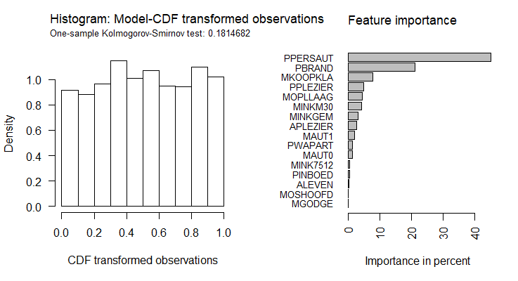

<!-- badges: start -->
[](https://travis-ci.org/Blunde1/agtboost)
[](https://www.tidyverse.org/lifecycle/#experimental)
[](https://opensource.org/licenses/MIT)
---------

# aGTBoost

**Adaptive and automatic gradient tree boosting computations**

aGTBoost is a lightning fast gradient boosting library designed to **avoid manual tuning** and **cross-validation** by utilizing an information theoretic approach.
This makes the algorithm **adaptive** to the dataset at hand; it is **completely automatic**, and with **minimal worries of overfitting**.
Consequently, the speed-ups relative to state-of-the-art implementations are in the thousands while mathematical and technical knowledge required on the user are minimized.


## Installation

**R**: Finally on CRAN! Install the stable version with
```r
install.packages("agtboost")
```
or install the development version from GitHub
```r
devtools::install_github("Blunde1/agtboost/R-package")
```
Users experiencing errors after warnings during installlation, may be helped by the following command prior to installation:

```r
Sys.setenv(R_REMOTES_NO_ERRORS_FROM_WARNINGS="true")
```

## Example code and documentation

`agtboost` essentially has two functions, a train function `gbt.train` and a predict function `predict`.
From the code below it should be clear how to train an aGTBoost model using a design matrix `x` and a response vector `y`, write `?gbt.train` in the console for detailed documentation. 
```r
library(agtboost)

# -- Load data --
data(caravan.train, package = "agtboost")
data(caravan.test, package = "agtboost")
train <- caravan.train
test <- caravan.test

# -- Model building --
mod <- gbt.train(train$y, train$x, loss_function = "logloss", verbose=10)

# -- Predictions --
prob <- predict(mod, test$x) # Score after logistic transformation: Probabilities
```
`agtboost`also contain functions for model inspection and validation. 

- Feature importance: `gbt.importance` generates a typical feature importance plot. 
Techniques like inserting noise-features are redundant due to computations w.r.t. approximate generalization (test) loss.
- Convergence: `gbt.convergence` computes the loss over the path of boosting iterations. Check visually for convergence on test loss.
- Model validation: `gbt.ksval` transforms observations to standard uniformly distributed random variables, if the model is specified 
correctly. Perform a formal Kolmogorov-Smirnov test and plots transformed observations for visual inspection.
```r
# -- Feature importance --
gbt.importance(feature_names=colnames(caravan.train$x), object=mod)

# -- Model validation --
gbt.ksval(object=mod, y=caravan.test$y, x=caravan.test$x)
```
The functions `gbt.ksval` and `gbt.importance` create the following plots:


Furthermore, an aGTBoost model is (see example code)

- highly robust to dimensions: [Comparisons to (penalized) linear regression in (very) high dimensions](R-package/demo/high-dimensions.R)
- has minimal worries of overfitting: [Stock market classificatin](R-package/demo/stock-market-classification.R)
- and can train further given previous models: [Boosting from a regularized linear model](R-package/demo/boost-from-predictions.R)


## Dependencies

- [My research](https://berentlunde.netlify.com/) 
- [Eigen](http://eigen.tuxfamily.org/index.php?title=Main_Page) Linear algebra
- [Rcpp](https://github.com/RcppCore/Rcpp) for the R-package

## Scheduled updates

- [x] Adaptive and automatic deterministic frequentist gradient tree boosting.
- [ ] Adaptive L2-penalized gradient tree boosting. (Fall 2020, planned)
- [ ] Automatic stochastic gradient tree boosting. (Fall 2020/Spring 2021, planned)

## Hopeful updates

- Optimal stochastic gradient tree boosting.

## References
- [An information criterion for automatic gradient tree boosting](https://arxiv.org/abs/2008.05926)
- [agtboost: Adaptive and Automatic Gradient Tree Boosting Computations](https://arxiv.org/abs/2008.12625)

## Contribute

Any help on the following subjects are especially welcome:

- Utilizing sparsity (possibly Eigen sparsity).
- Paralellizatin (CPU and/or GPU).
- Distribution (Python, Java, Scala, ...),
- good ideas and coding best-practices in general.

Please note that the priority is to work on and push the above mentioned scheduled updates. Patience is a virtue. :)
